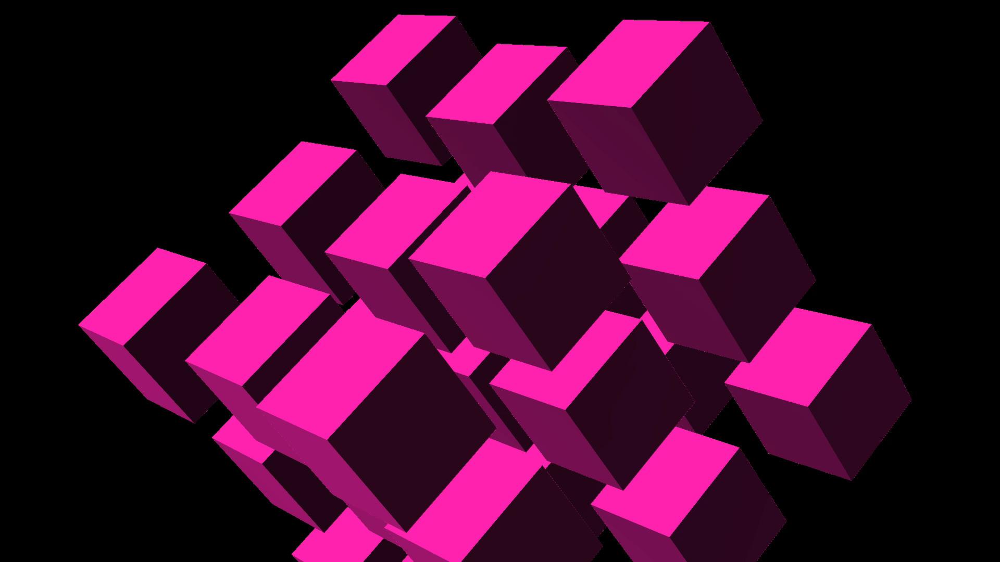
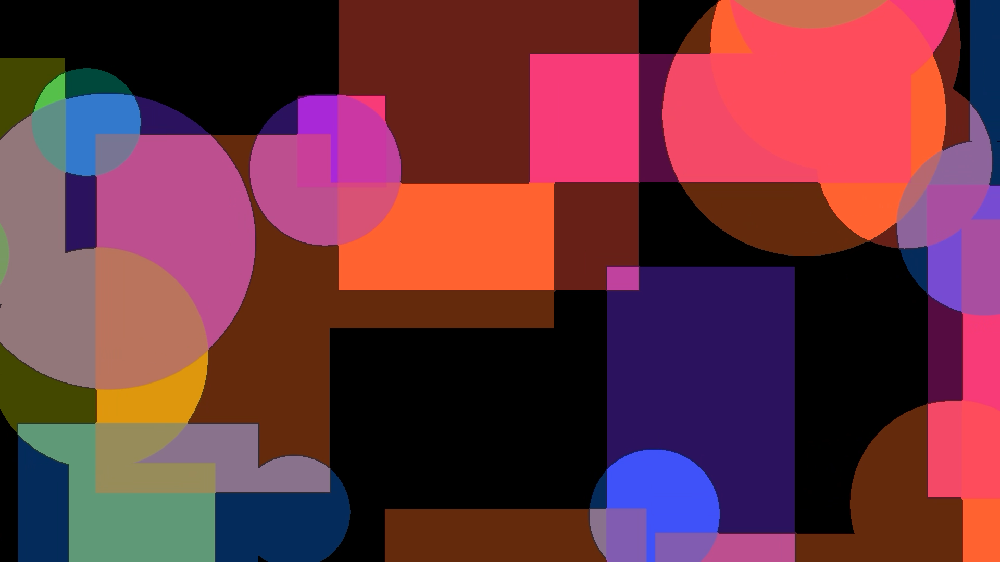
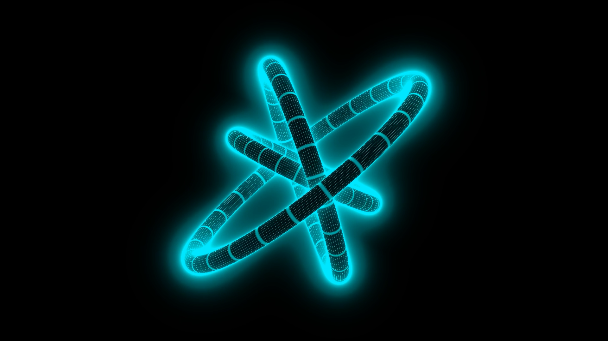

# Shaders by Sonic Walker

Audio-reactive GLSL shaders for [VS2 (Visual Synthesizer 2)](https://imaginando.github.io/vs/) by Imaginando, with ISF versions for compatible VJ software.

## Installation

### VS2

1. Download the `.frag` file(s) you want
2. In VS2, open the **Material Editor**
3. Click **Import** and select the `.frag` file
4. The shader appears under **Shaders > User Materials**

### ISF

Download the `.fs` file(s) and import them into your ISF-compatible host (VDMX, Resolume, etc.). Note that audio-reactive features that rely on VS2's built-in FFT texture may need to be set up differently in ISF hosts.

## Shaders

### Generators

#### Eclectic Cubes

<a href="https://haraldwalker.github.io/sonicwalker-shaders/shaders/eclectic-cubes"></a>

A 3×3×3 grid of cubes rendered with raymarching.

**Files:** [eclectic-cubes.frag](shaders/generators/eclectic-cubes/eclectic-cubes.frag) (VS2) · [eclectic-cubes.fs](shaders/generators/eclectic-cubes/eclectic-cubes.fs) (ISF)

#### Xor Panes

<a href="https://haraldwalker.github.io/sonicwalker-shaders/shaders/xor-panes"></a>

Multiple layers of animated rectangles and circles with quantized brightness based on overlap count.

**Files:** [xor-panes.frag](shaders/generators/xor-panes/xor-panes.frag) (VS2) · [xor-panes.fs](shaders/generators/xor-panes/xor-panes.fs) (ISF)

#### Rotating 3D Rings

<a href="https://haraldwalker.github.io/sonicwalker-shaders/shaders/rotating-3d-rings"></a>

Raymarched rotating torus rings with wireframe shading and glow.

**Files:** [rotating-3d-rings.frag](shaders/generators/rotating-3d-rings/rotating-3d-rings.frag) (VS2) · [rotating-3d-rings.fs](shaders/generators/rotating-3d-rings/rotating-3d-rings.fs) (ISF)

## Structure

Each shader lives in its own folder under `shaders/generators/` or `shaders/effects/`:

```
shaders/
  generators/
    my-shader/
      my-shader.frag        # VS2 version
      my-shader.fs          # ISF version (where available)
      my-shader.png         # Screenshot
  effects/
    ...                      # Future effects
```

## License

The shader source code is licensed under [Creative Commons Attribution-NonCommercial-ShareAlike 4.0 International (CC BY-NC-SA 4.0)](https://creativecommons.org/licenses/by-nc-sa/4.0/).

This means you can share and adapt the code for non-commercial purposes, as long as you credit me and distribute your contributions under the same license. Commercial redistribution of the source code requires permission.

See [LICENSE](LICENSE) for the full legal text.

## Using the Output

The visual output produced by running these shaders is yours to use. VJ at a party, use it in a music video, project it at a festival -- go for it.

If you're making money from it, I'd really appreciate it if you'd support my music. No obligation, just good karma.

- **Buy my music**
- **Gift my music with a friend**
- **Or just spread the word**

You can find my music at [sonicwalker.com](https://www.sonicwalker.com).

If these conditions are too restrictive, please contact me.

## Author

**Harald Walker** / Sonic Walker
- [sonicwalker.com](https://www.sonicwalker.com)

---

Made with ❤️ in East-Westphalia.
